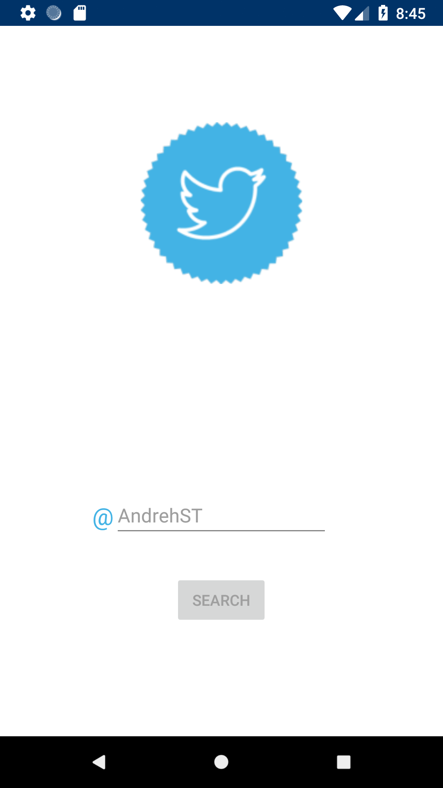
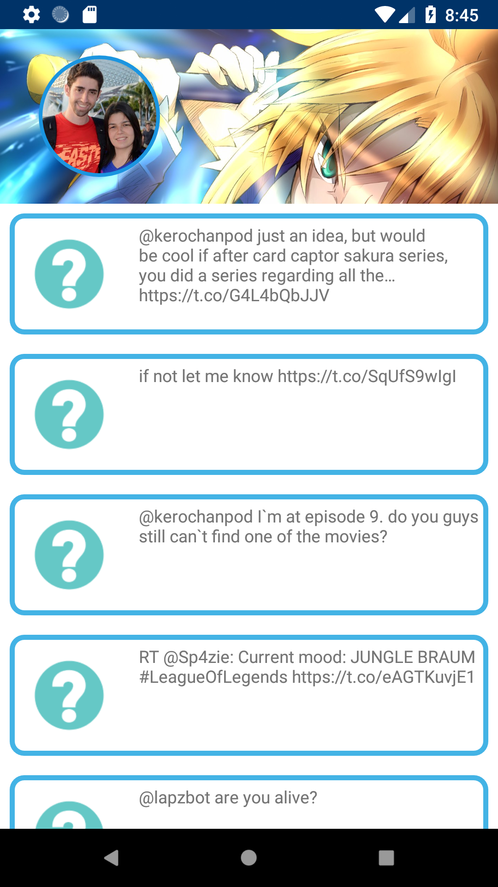
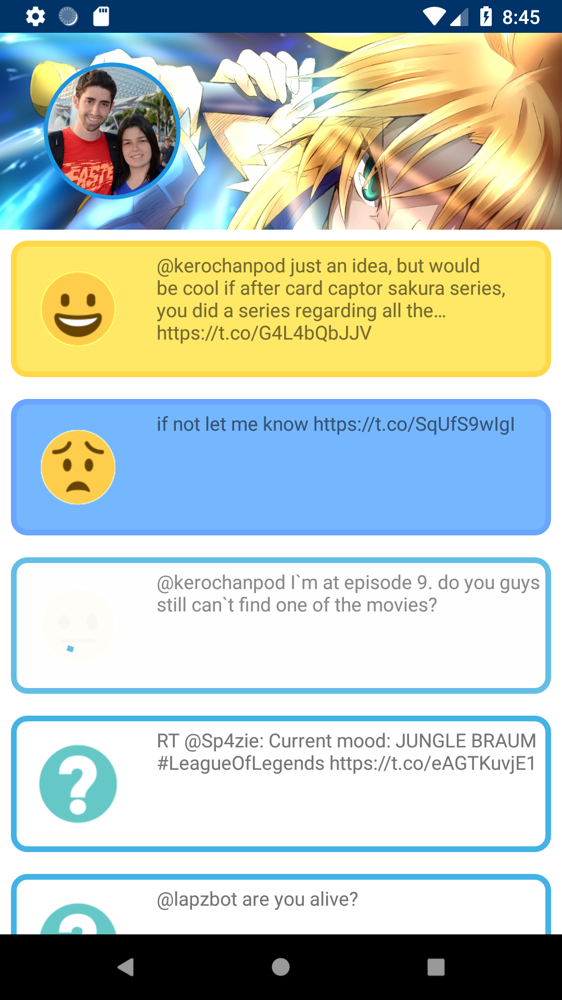
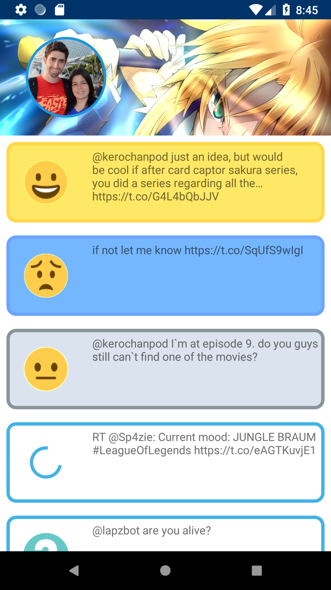

## Happy Twitter

### Snapshots

  
  
  
  

### Orientation change maintains state

  

## About the project

Happy Twitter is an Android App that given an twitter @User will list its tweets, and upon clicking on each individual tweet, will display the sentiment of that tweet (based on Google Natural Language processing API)

## Solution
### Architecture

* MVI (Model View Intent) - Provides a unidirectional data flow and immutability, MVI based on JS frameworks such as Cycle.js and Redux, the key principle is that user interacts with the app from "Actions", actions will eventually create a new ViewState for the UI to render. MVI is designed to work with stream os datas (Observables) much like MVVM, but in the end, Unit Testing MVI looks simpler

* Repository Pattern - Abstraction of Domain Layer

### Libraries

* [Room](https://developer.android.com/topic/libraries/architecture/room) - abstraction layer over SQLite to allow for more robust database access while harnessing the full power of SQLite.
* [ViewModel](https://developer.android.com/topic/libraries/architecture/viewmodel) - The ViewModel class allows data to survive configuration changes such as screen rotations.
* [Dagger 2](https://github.com/google/dagger) - A fast dependency injector for Android and Java.
* [RxJava](https://github.com/ReactiveX/RxJava) - library for composing asynchronous and event-based programs by using observable sequences.
* [RxAndroid](https://github.com/ReactiveX/RxAndroid) - it provides a Scheduler that schedules on the main thread or any given Looper.
* [Picasso](http://square.github.io/picasso/) - Picasso allows for hassle-free image loading in your application
* [CircleImageVIew](https://github.com/hdodenhof/CircleImageView) - A fast circular ImageView perfect for profile images.
* [Retrofit](http://square.github.io/retrofit/) - Retrofit turns your HTTP API into a Java interface.
* [Mockito](http://site.mockito.org/) - Mockito is a mocking framework that tastes really good. It lets you write beautiful tests with a clean & simple API. Mockito doesn’t give you hangover because the tests are very readable and they produce clean verification errors. 